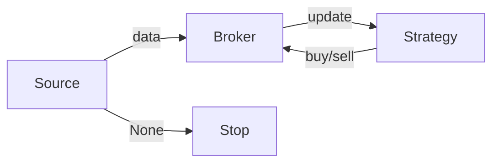

# Quool

Quool是一个专为量化投资研究而设计的Python框架，旨在提供一套灵活、高效的工具集，帮助研究人员和开发者快速实现数据处理、因子分析、交易记录以及策略评估等功能。通过Quool，用户可以专注于策略和因子的研究，而无需花费大量时间在数据管理和基础设施构建上。

## 特性

- **数据管理**：提供本地化管理的Parquet文件集合，能够通过Parquet文件作为数据库底层支撑，而无需开启任何数据库服务。
- 回测引擎：提供可扩展的回测引擎，同时也有开箱即用的回测工具类。
- **策略评估**：集成策略评估工具，支持多种性能指标计算和结果可视化。

## 安装

您可以通过以下方式从源代码安装：

```bash
git clone https://github.com/your-username/quool.git
cd quool
pip install .
```

## 快速入门

### 数据管理

Quool中提供了一个ParquetManager类，你可以使用它轻松的管理本地的parquet文件，并作为底层数据库提供给你的策略使用，你可以使用如下代码来创建一个ParquetManager实例：

```python
# path为你的数据库存储路径，不存在则会新建，只要到目录即可，不到某一个具体文件，因为Parquet是以目录作为管理的基本单元
# index为你的数据库目录的唯一索引列名，例如你的因子库，可能对于某一个时间和某一只股票，数据库中记录唯一，index就要设置为["date", "code"]
# partition为你的数据库分区列名，ParquetManager会按照该列对数据进行分区分文件存储
pm = ParquetManager(path="test", index=["index"], partition="month")
```

你可以通过如下代码来存储数据：

```python
# data是你要存储的数据，partition可以很多类型，当他为字符串时，表示直接采用data中的"month"列对data进行分区存储
pm.upsert(data, partition="month")
```

你可以通过如下代码来读取数据：

```python
# index表示读取出来的数据是以哪一列作为索引的
# columns表示读取出的数据有哪些列，当设置了pivot时，表示将那一列旋转成列
# pivot如果非空，表示进行旋转，其值表示了旋转的value
# 上述三个参数之后的参数都是过滤器，过滤器可以采用"列名__操作符"的方式设置，表示改列满足哪些条件的数据
pm.read(index="index", columns="codes", pivot="close", date__ge="2020-01-01")
```

### 回测引擎

Quool提供了一个可以轻松扩展的回测引擎。这个引擎有如下几个重要的组件：

1. **Delivery/Order，用于表示交割单、订单，是引擎内数据流转的重要组件**
2. **Broker，用于表示交易的经纪商，是管理订单、交割单的重要组件**
3. **Source，用于提供回测中必要的数据，是驱动引擎运作的根本单元**
4. **Strategy，普通用户最直接接触到的回测接口，是策略编写的重要组件**
5. **Friction，交易摩擦的具体实现，可以用于扩展手续费、滑点**

回测引擎的运作模式如下



1. **数据源（Source）**
   回测引擎的起点是数据源（Source），它提供了历史市场数据（如价格、成交量等）。这些数据是回测的基础，用于模拟市场环境。
2. **数据传递到Broker**
   数据从数据源（Source）传递到Broker（交易代理）。Broker负责接收数据，并根据数据更新当前的broker状态。
3. **Broker执行交易**
   Broker将使用Source传递进来的市场数据进行交易，包括订单撮合、成交匹配。
4. **策略生成交易信号**
   策略（Strategy）在Broker完成上一轮的成交后，生成交易信号（如买入或卖出），并将这些信号传递回Broker。
5. **数据源直接传递信号到停止条件（Stop）**
   在某些情况下，数据源（Source）会直接传递信号到停止条件（Stop）。例如，当回测时间范围结束或达到预设的停止条件时，回测引擎会停止运行。
6. **停止条件（Stop）**
   停止条件（Stop）是回测引擎的终点。当满足停止条件时，回测引擎会终止运行，并输出回测结果（如收益、最大回撤等）。

如下是一个简单的示例

```python
frmo quool import Strategy

class MyStrategy(Strategy):

    def update(self, **kwargs):
        if "000001.SZ" in self.get_positions().index:
            self.close("000001.SZ")
        else:
            self.buy("000001.SZ", quantity=100)
```

## 贡献

欢迎通过GitHub提交问题报告和拉取请求来贡献代码。

## 许可证

Quool遵循MIT许可证发布。
